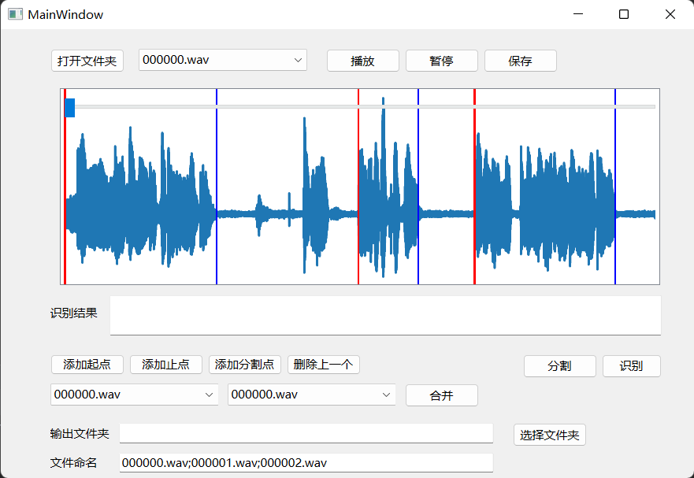

# audio_process
简易便捷音频处理程序，支持自动分割和语音识别

支持对wav格式音频进行保存、分割和合并，并支持自动分割和调用paddlespeech自动识别语音。

## 备注

`asr.py`只是简单重写了原方法，使其能直接识别pydub的AudioSegment对象，但一些报错处直接被我注释了。

paddlespeech会大大影响性能，如无需要，建议注释或删除掉相关代码；如有批量需求，可以先用本程序分割， 再用paddlespeech识别比较快。
